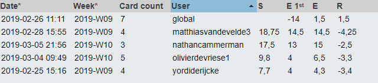

# Lastenboek Taak 1: Working with Cisco switches and routers

(Instructies vind je tussen haakjes. Verwijder die als het document volledig ingevuld is.)

## Deliverables

(Som hier de concrete eindresultaten op die je voor deze opdracht moet opleveren.)
* Configured IPv6 static and default routes
* Accessed and Configured switch with basic settings through console connection
* Built + configured simple network(2 PC’s + 2 switches)
* Built + configured simple network(2 PC’s + switch + router)
* Built + configured basic static route network(3 PC’s + 3 switches + 3 routers)
* Quick guides on how to realise the test setups
* Packet Tracer setups
* Detailed report of test setups
* Checklist: How to reset a Cisco router and switch with remaining settings
* Cheat sheet with basic IOS commands

## Deeltaken

(Som hier de deeltaken voor deze opdracht op en duid voor elk een verantwoordelijke en tester aan. Vermeld ook afhankelijkheden tussen deeltaken als die er zijn. Elke deeltaak wordt een kaartje op het kanban-bord!)

1. Opdracht-01-lab1
    - Verantwoordelijke: Olivier De Vriese, Yordi De Rijcke
    - Tester: Yordi De Rijcke
2. Opdracht-01-lab2
    - Verantwoordelijke: Olivier De Vriese, Yordi De Rijcke
    - Tester: Olivier De Vriese
3. Opdracht-01-lab3
    - Verantwoordelijke: Olivier De Vriese, Yordi De Rijcke
    - Tester: Yordi De Rijcke
4. Opdracht-01-lab4
    - Verantwoordelijke: Nathan Cammerman, Matthias Van De Velde
    - Tester: Olivier De Vriese
5. Opdracht-01-Packet Tracer exercises
    - Verantwoordelijke: Nathan Cammerman, Matthias Van De Velde
    - Tester: Nathan Cammerman, Matthias Van De Velde
6. Reset guide Cisco router/switch
    - Verantwoordelijke: Nathan Cammerman, Matthias Van De Velde
    - Tester: Nathan Cammerman, Matthias Van De Velde
    
## Tijdbesteding

| Student    | Geschat | Gerealiseerd |
| :---       | ---:    | ---:         |
| Yordi De Rijcke   |     6    |      5.5       |
| Olivier De Vriese   |    6.5     |     5.5         |
| Nathan Cammerman   |     13    |      17.5        |
| Matthias Van De Velde   |    13     |     18.8         |
| **totaal** |    38.5     |       47.3       |

