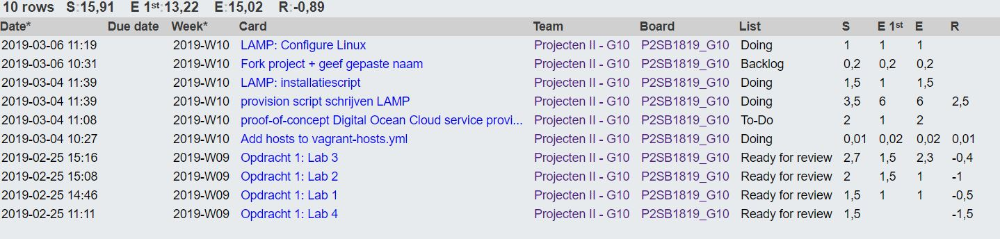
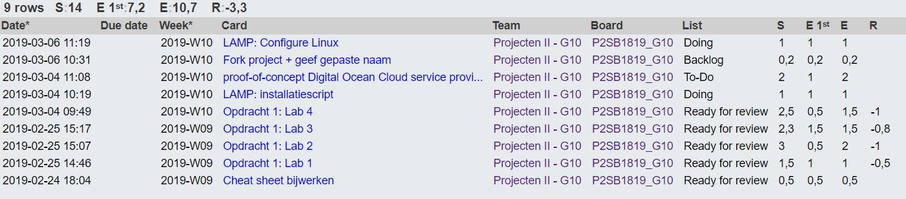
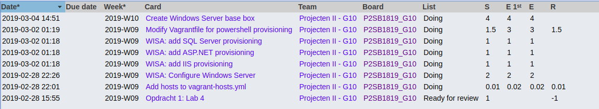

# Voortgangsrapport week 04

* Groep: 10
* Datum voortgangsgesprek: 04/03/2019

| Student  | Aanw. | Opmerking |
| :---     | :---  | :---      |
| Yordi De Rijcke |    x   |           |
| Olivier De Vriese |   x    |           |
| Nathan Cammerman |    x   |           |
| Matthias Van De Velde |    x   |           |

## Wat heb je deze week gerealiseerd?

### Algemeen

* Labo 4 fysiek gedeelte.
* Gestart met WISA configuratie windows server.
* Gestart met WISA creatie Windows Server base box.
* Gestart met WISA Vagrant file aanpassen voor powershell provisioning.
* Gestart met WISA host toevoegen in vagrant-hosts.yml
* Gestart met WISA IIS provisioning.
* Gestart met WISA ASP.NET provisioning.
* Gestart met WISA SQL Server provisioning.
* Gestart met LAMP installatiescript.
* Gestart met LAMP configuratie Apache.

### Yordi De Rijcke

* Gestart met LAMP installatiescript.
* Gestart met LAMP configuratie Apache.

[Afbeelding individueel rapport tijdregistratie]

### Olivier De Vriese

* Gestart met LAMP installatiescript.
* Gestart met LAMP configuratie Apache.

[Afbeelding individueel rapport tijdregistratie]

### Nathan Cammerman

* Labo 4 fysiek gedeelte.
* Gestart met WISA configuratie windows server.
* Gestart met WISA creatie Windows Server base box.
* Gestart testplan WISA.

[Afbeelding individueel rapport tijdregistratie]
[

### Matthias Van De Velde

* Labo 4 fysiek gedeelte.
* Gestart met WISA configuratie windows server.
* Gestart met WISA creatie Windows Server base box.
* Gestart met WISA Vagrant file aanpassen voor powershell provisioning.
* Gestart met WISA host toevoegen in vagrant-hosts.yml
* Gestart met WISA IIS provisioning.
* Gestart met WISA ASP.NET provisioning.
* Gestart met WISA SQL Server provisioning.

[Afbeelding individueel rapport tijdregistratie]
  

## Wat plan je volgende week te doen?

### Algemeen
### Yordi De Rijcke
* Configuratie Linux
* Configuratie MariaDB
* Installscript verbeteren

### Olivier De Vriese
* Configuratie Linux
* Configuratie MariaDB
* Installscript verbeteren

### Nathan Cammerman
* Wisa testplan maken
* Dowloading base box
* Technische documentatie maken
* Gebruikersdocumentatie maken
* Documentatie Vagrant lezen
### Matthias Van De Velde
* Base box rework
* Implement provisioning for IIS, SQL Server and ASP.NET
* Adding Windows support to Vagrantfile
* Uploading base box to the cloud
* Documentatie Vagrant lezen

## Waar hebben jullie nog problemen mee?

* Olivier & Yordi: Tijdsregistratie beter bijhouden
* ...

## Feedback technisch luik

### Algemeen

### Yordi De Rijcke
### Olivier De Vriese
### Nathan Cammerman
### Matthias Van De Velde

## Feedback analyseluik

### Algemeen

### Yordi De Rijcke
### Olivier De Vriese
### Nathan Cammerman
### Matthias Van De Velde

