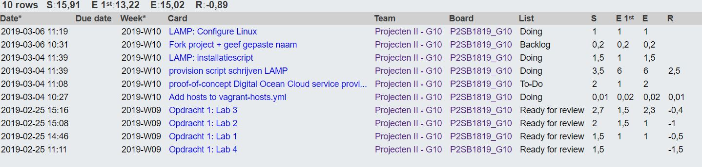
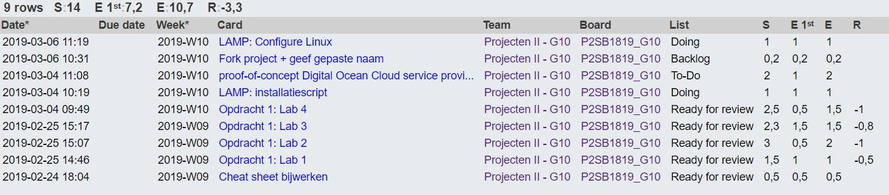
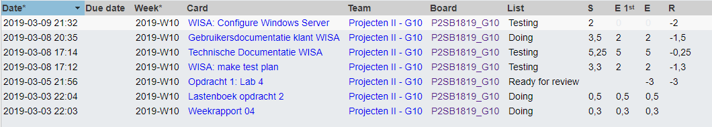
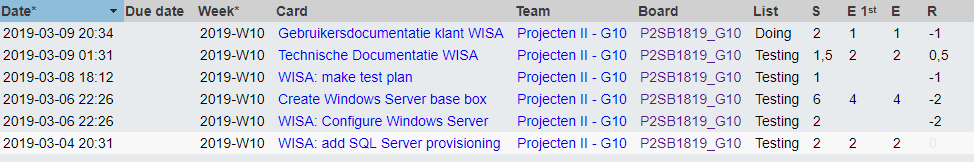
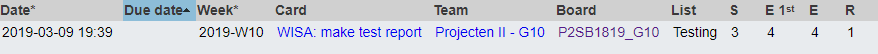

# Voortgangsrapport week 05

* Groep: 10
* Datum voortgangsgesprek:

| Student  | Aanw. | Opmerking |
| :---     | :---  | :---      |
| Yordi De Rijcke |       |           |
| Olivier De Vriese |       |           |
| Nathan Cammerman |       |           |
| Jens Van Liefferinge |      |         |
| Matthias Van De Velde |       |           |

## Wat heb je deze week gerealiseerd?

### Algemeen

[Afbeelding huidige toestand Kanban-bord(en) invoegen]

* Windows 2016 base box gemaakt
* Windows 2016 base box geüpload op Vagrant Cloud
* Support voor windows in Vagrantfile toegevoegd
* Provisioning scripts voor IIS, SQL Server and ASP.NET toegevoegd
* Gebruikers- en technische documentatie voor WISA stack toegevoegd
* Eerste testplan en testrapport voor WISA stack toegevoegd
* Linux configuratie
* MariaDB configuratie
* Installatiescript verbeterd

[Afbeelding teamoverzicht tijdregistratie onderverdeeld per deelopdracht]

### Yordi De Rijcke

* Linux configuratie
* MariaDB configuratie
* Installatiescript verbeterd

[Afbeelding individueel rapport tijdregistratie]

### Olivier De Vriese
* Linux configuratie
* MariaDB configuratie
* Installatiescript verbeterd

[Afbeelding individueel rapport tijdregistratie]

### Nathan Cammerman

* Technische documentatie aanvullen
* Gebruikersdocumentatie aanvullen
* Wisa Testplan
* Windows support aan Vagrantfile toegevoegd
* Forwarded ports aan vagrant-hosts.yml toegevoegd

### Matthias Van De Velde

* Base box reworked
* Fixed RDP connection firewall rules
* Edited provisioning scripts
* Forwarded ports aan vagrant-hosts.yml toegevoegd
* Technische documentatie aanvullen
* Gebruikersdocumentatie aanvullen
* Windows support aan Vagrantfile toegevoegd

### Jens Van Liefferinge

* Testrapport 1 WISA_Vagrant

## Wat plan je volgende week te doen?

### Algemeen
### Yordi De Rijcke
* LAMP proof of concept Drupal
* Documentatie schrijven

### Olivier De Vriese
* LAMP proof of concept Drupal
* Documentatie schrijven

### Nathan Cammerman
* WISA Proof of concept op Lightsail
### Matthias Van De Velde
* WISA Proof of concept op Lightsail
### Jens Van Liefferinge
* Testrapporten

## Waar hebben jullie nog problemen mee?

* ...
* ...

## Feedback technisch luik

### Algemeen

### Yordi De Rijcke
### Olivier De Vriese
### Nathan Cammerman
### Matthias Van De Velde

## Feedback analyseluik

### Algemeen

### Yordi De Rijcke
### Olivier De Vriese
### Nathan Cammerman
### Matthias Van De Velde

