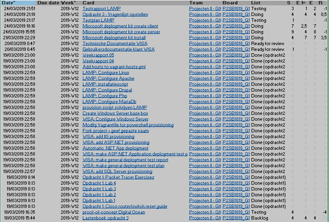
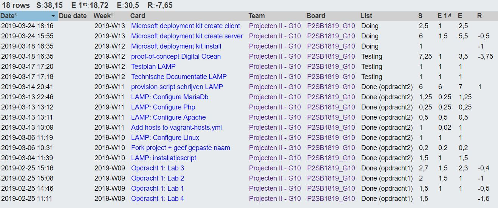
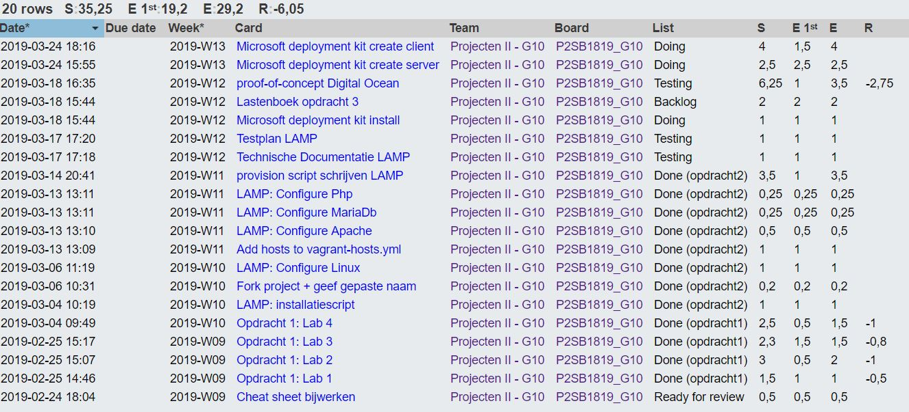
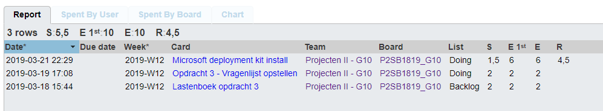
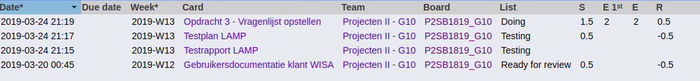

# Voortgangsrapport week 07

* Groep: 10
* Datum voortgangsgesprek: 25/03/2019

| Student  | Aanw. | Opmerking |
| :---     | :---  | :---      |
| Yordi De Rijcke |   x    |           |
| Olivier De Vriese |  x     |           |
| Nathan Cammerman |    x   |           |
| Jens Van Liefferinge |    x   |         |
| Matthias Van De Velde | x      |           |

## Wat heb je deze week gerealiseerd?

### Algemeen

* Testplan LAMP.
* Testrapport LAMP.
* Opdracht 3 vragenlijst opstellen.
* Microsoft deployment kit client.
* Microsoft deployment kit server.
* Microsoft deployment kit opzoekwerk.
* Lichte aanpassing WISA gebruikersdocumentatie.
* Proof-of-concept Digital Ocean. 

### Yordi De Rijcke
* Microsoft deployment kit client.
* Microsoft deployment kit server.
* Proof-of-concept Digital Ocean. 

### Olivier De Vriese
* Microsoft deployment kit client.
* Microsoft deployment kit server.
* Proof-of-concept Digital Ocean. 

### Nathan Cammerman
* Opdracht 3 vragenlijst opstellen.
* Microsoft deployment kit opzoekwerk.

### Matthias Van De Velde
* Testplan LAMP.
* Lichte aanpassing WISA gebruikersdocumentatie.
* Opdracht 3 vragenlijst opstellen.

### Jens Van Liefferinge
* Testrapport LAMP.

## Wat plan je volgende week te doen?

### Algemeen

### Yordi De Rijcke
* Opdracht 4.
### Olivier De Vriese
* Opdracht 4.
### Nathan Cammerman
* Research opdracht 5.
### Matthias Van De Velde
* Research opdracht 5.
### Jens Van Liefferinge
* Research opdracht 5.
## Waar hebben jullie nog problemen mee?

* Estimate voor sommige deelopdrachten onderschat

## Feedback technisch luik

### Algemeen

### Yordi De Rijcke
### Olivier De Vriese
### Nathan Cammerman
### Matthias Van De Velde
### Jens Van Liefferinge

## Feedback analyseluik

### Algemeen

### Yordi De Rijcke
### Olivier De Vriese
### Nathan Cammerman
### Matthias Van De Velde
### Jens Van Liefferinge

