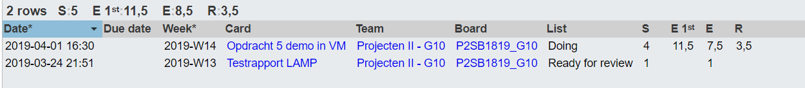

# Voortgangsrapport week 08

* Groep: 10
* Datum voortgangsgesprek: 01/04/2019

| Student  | Aanw. | Opmerking |
| :---     | :---  | :---      |
| Yordi De Rijcke |   x    |           |
| Olivier De Vriese |  x     |           |
| Nathan Cammerman |    x   |           |
| Jens Van Liefferinge |    x   |         |
| Matthias Van De Velde | x      |           |

## Wat heb je deze week gerealiseerd?

### Algemeen

* Opdracht 5 demo NAS in VM
* MDT technische documentatie
* vragenlijst opstellen vastgoed
* MDT create server
* MDT client
* Windows-Server auto deploy
* Testplan LAMP aanpassen

### Yordi De Rijcke
* MDT technische documentatie
* MDT create server
* MDT client

### Olivier De Vriese
* MDT technische documentatie
* MDT create server

### Nathan Cammerman
* Opdracht 5 demo NAS in VM
* vragenlijst opstellen vastgoed

### Matthias Van De Velde
* Windows-Server auto deploy
* vragenlijst opstellen vastgoed
* Testplan LAMP aanpassen

### Jens Van Liefferinge
* Opdracht 5 demo NAS in VM

## Wat plan je volgende week te doen?

### Algemeen

### Yordi De Rijcke
* Lastenboek in orde brengen
### Olivier De Vriese
* Lastenboek in orde brengen
### Nathan Cammerman
* Opdracht 4 automatisatie server 
### Matthias Van De Velde
* opdracht 4 automatisatie server
### Jens Van Liefferinge
* opdracht 3 verslag + offerte
## Waar hebben jullie nog problemen mee?

* Estimate voor sommige deelopdrachten onderschat

## Feedback technisch luik

### Algemeen

### Yordi De Rijcke
### Olivier De Vriese
### Nathan Cammerman
### Matthias Van De Velde
### Jens Van Liefferinge

## Feedback analyseluik

### Algemeen

### Yordi De Rijcke
### Olivier De Vriese
### Nathan Cammerman
### Matthias Van De Velde
### Jens Van Liefferinge

