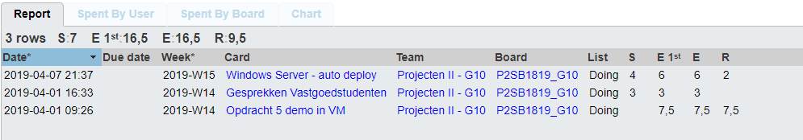

# Voortgangsrapport week 09

* Groep: 10
* Datum voortgangsgesprek:

| Student  | Aanw. | Opmerking |
| :---     | :---  | :---      |
| Yordi De Rijcke |        |           |
| Olivier De Vriese |        |           |
| Nathan Cammerman |        |           |
| Jens Van Liefferinge |        |         |
| Matthias Van De Velde |        |           |

## Wat heb je deze week gerealiseerd?

### Algemeen

* MDT: Technische documentatie
* Research opdracht05
* Windows Server: autodeploy using Powershell
* Verslagen van gesprekken met vastgoedstudenten
* Gesprekken met vastgoedstudenten

### Yordi De Rijcke

* Gesprekken met vastgoedstudenten
* MDT technische documentatie opstellen
* MDT client verder afwerken
* Eerste packet tracer opstelling vastgoedstudenten

### Olivier De Vriese

* Gesprekken met vastgoedstudenten
* MDT technische documentatie opstellen
* MDT client verder afwerken
* Eerste packet tracer opstelling vastgoedstudenten 

### Nathan Cammerman

* Windows Server: autodeploy using Powershell
* Gesprekken met vastgoedstudenten

### Matthias Van De Velde
* Windows Server: autodeploy using Powershell
* Verslagen van gesprekken met vastgoedstudenten
* Gesprekken met vastgoedstudenten

### Jens Van Liefferinge

## Wat plan je volgende week te doen?

### Algemeen

### Yordi De Rijcke
### Olivier De Vriese
### Nathan Cammerman
* Opdracht 4 automatisatie server 
### Matthias Van De Velde
* opdracht 4 automatisatie server
### Jens Van Liefferinge
* opdracht 4 automatisatie server

## Waar hebben jullie nog problemen mee?
* Estimate voor sommige deelopdrachten onderschat

## Feedback technisch luik

### Algemeen

### Yordi De Rijcke
### Olivier De Vriese
### Nathan Cammerman
### Matthias Van De Velde
### Jens Van Liefferinge

## Feedback analyseluik

### Algemeen

### Yordi De Rijcke
### Olivier De Vriese
### Nathan Cammerman
### Matthias Van De Velde
### Jens Van Liefferinge

