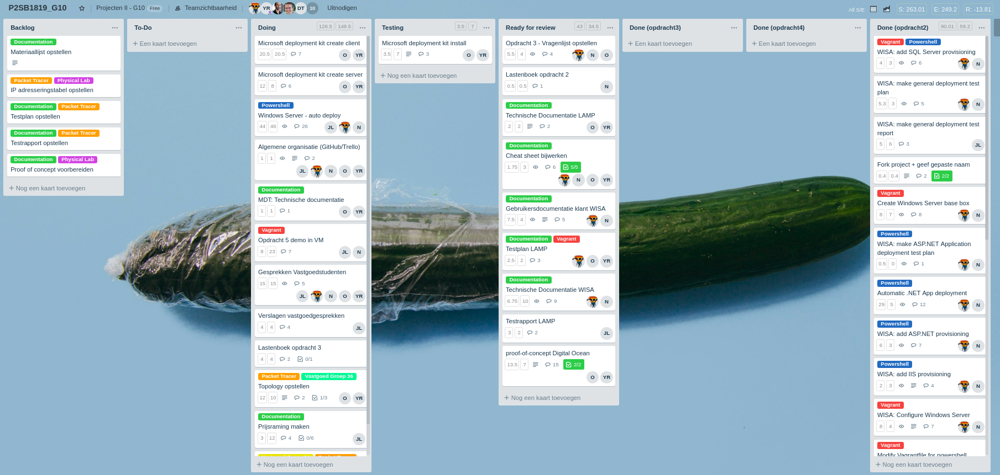
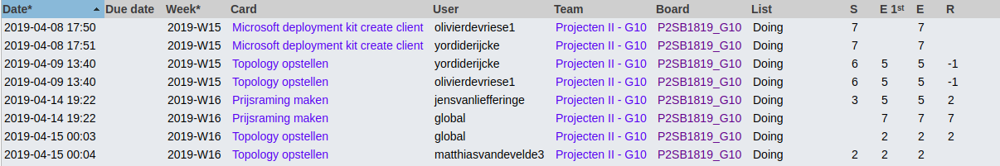
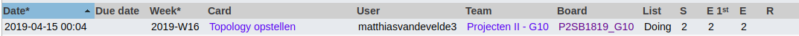
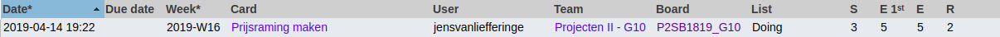

# Voortgangsrapport week 10

* Groep: 10
* Datum voortgangsgesprek:

| Student  | Aanw. | Opmerking |
| :---     | :---  | :---      |
| Yordi De Rijcke |        |           |
| Olivier De Vriese |        |           |
| Nathan Cammerman |        |           |
| Jens Van Liefferinge |        |         |
| Matthias Van De Velde |        |           |

## Wat heb je deze week gerealiseerd?

### Algemeen

* MDT create client
* Logical network topology PT: G24
* Prijsraming template

### Yordi De Rijcke

* MDT further client configuration

### Olivier De Vriese

* MDT further client configuration

### Nathan Cammerman

### Matthias Van De Velde
* Logical network topology PT: G24

### Jens Van Liefferinge

## Wat plan je volgende week te doen?

### Algemeen

### Yordi De Rijcke
### Olivier De Vriese
### Nathan Cammerman
* Opdracht 4 automatisatie server 
### Matthias Van De Velde
* Opdracht 4 automatisatie server 
### Jens Van Liefferinge
* Offertes

## Waar hebben jullie nog problemen mee?

## Feedback technisch luik

### Algemeen

### Yordi De Rijcke
### Olivier De Vriese
### Nathan Cammerman
### Matthias Van De Velde
### Jens Van Liefferinge

## Feedback analyseluik

### Algemeen

### Yordi De Rijcke
### Olivier De Vriese
### Nathan Cammerman
### Matthias Van De Velde
### Jens Van Liefferinge

