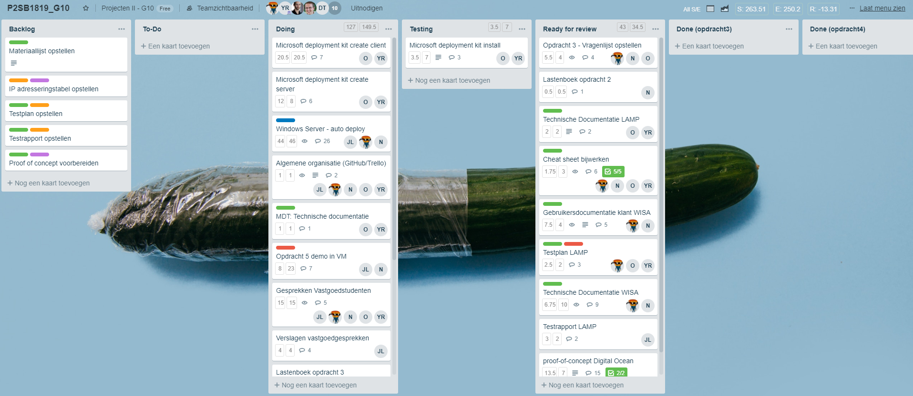
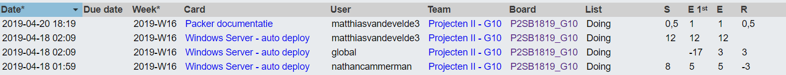
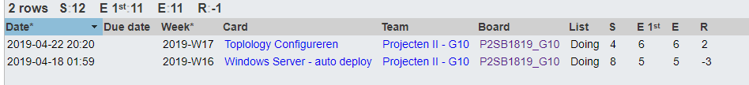
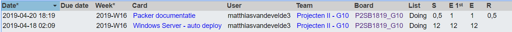

# Voortgangsrapport week 11

* Groep: 11
* Datum voortgangsgesprek:

| Student  | Aanw. | Opmerking |
| :---     | :---  | :---      |
| Yordi De Rijcke |        |           |
| Olivier De Vriese |        |           |
| Nathan Cammerman |        |           |
| Jens Van Liefferinge |        |         |
| Matthias Van De Velde |        |           |

## Wat heb je deze week gerealiseerd?

### Algemeen

* Windows Server - autodeploy (mdt)
* Paker documentation

### Yordi De Rijcke

### Olivier De Vriese

### Nathan Cammerman

### Matthias Van De Velde
* Packer documentation
* Windows server - autodeploy (mdt)

### Jens Van Liefferinge

## Wat plan je volgende week te doen?

### Algemeen

### Yordi De Rijcke
### Olivier De Vriese
### Nathan Cammerman
### Matthias Van De Velde
* Finish topology G24 and 40
* Create IP tables
* Product research for offers
### Jens Van Liefferinge

## Waar hebben jullie nog problemen mee?

## Feedback technisch luik

### Algemeen

### Yordi De Rijcke
### Olivier De Vriese
### Nathan Cammerman
### Matthias Van De Velde
### Jens Van Liefferinge

## Feedback analyseluik

### Algemeen

### Yordi De Rijcke
### Olivier De Vriese
### Nathan Cammerman
### Matthias Van De Velde
### Jens Van Liefferinge

