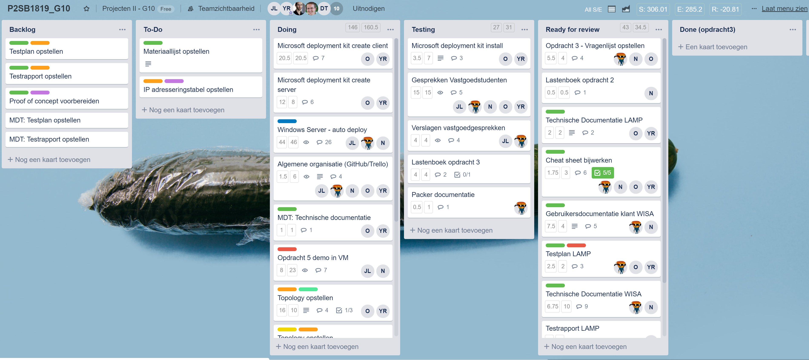
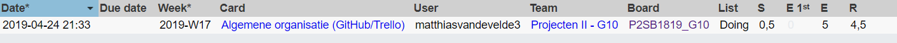

# Voortgangsrapport week 12

* Groep: 10
* Datum voortgangsgesprek: 28/04/2019

| Student  | Aanw. | Opmerking |
| :---     | :---  | :---      |
| Yordi De Rijcke |   x   |           |
| Olivier De Vriese |   x    |           |
| Nathan Cammerman |   x    |           |
| Jens Van Liefferinge |   x   |         |
| Matthias Van De Velde |   x    |           |

## Wat heb je deze week gerealiseerd?

### Algemeen

* Offertes G24, G36, G40
* Voorbereiden Voorstelling G24, G36, G40
* Lastenboek opdracht 3
* Topologie G24, G36, G40
* Documentatie topologie G36, G40

### Yordi De Rijcke

* Logische netwerk topologie PT: G36
* Logische netwerk topologie PT: G40
* Documentatie topologie G36
* Documentatie topologie G40

### Olivier De Vriese

* Logische netwerk topologie PT: G36
* Logische netwerk topologie PT: G40
* Documentatie topologie G36
* Documentatie topologie G40

### Nathan Cammerman

* ...

### Matthias Van De Velde

* Opdracht 3: lastenboek aangevuld

### Jens Van Liefferinge

* Offertes en Voorstelling g24,36,40

## Wat plan je volgende week te doen?

### Algemeen
### Yordi De Rijcke
### Olivier De Vriese
### Nathan Cammerman
### Matthias Van De Velde

## Waar hebben jullie nog problemen mee?

* ...
* ...

## Feedback technisch luik

### Algemeen

### Yordi De Rijcke
### Olivier De Vriese
### Nathan Cammerman
### Matthias Van De Velde

## Feedback analyseluik

### Algemeen

### Yordi De Rijcke
### Olivier De Vriese
### Nathan Cammerman
### Matthias Van De Velde

