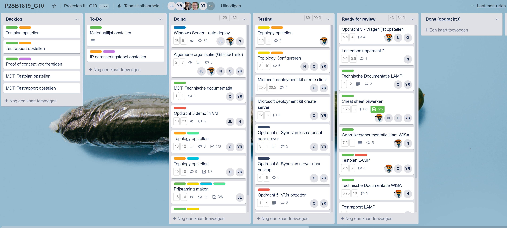
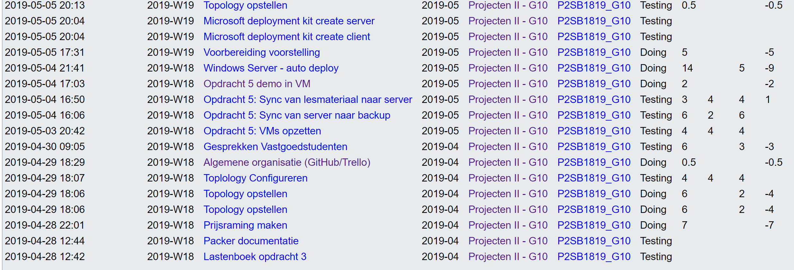
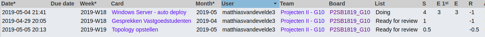
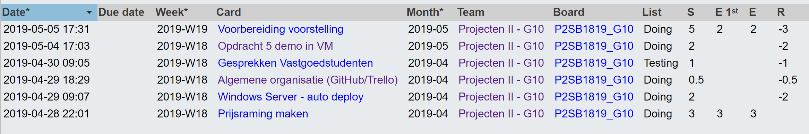

# Voortgangsrapport week 13

* Groep: 10
* Datum voortgangsgesprek: 06/05/2019

| Student  | Aanw. | Opmerking |
| :---     | :---  | :---      |
| Yordi De Rijcke |   x   |           |
| Olivier De Vriese |   x    |           |
| Nathan Cammerman |   x    |           |
| Jens Van Liefferinge |   x   |         |
| Matthias Van De Velde |   x    |           |

## Wat heb je deze week gerealiseerd?

### Algemeen

* Offertes G24, G36, G40
* Voorbereiden Voorstelling G24, G36, G40
* Lastenboek opdracht 3
* Fysieke topologie G24, G40
* G24 Packet Tracer configuratie
* Opdracht 5 lastenboek
* Opdracht 5 VMs
* Opdracht 5 sync lesmateriaal naar backupserver
* Fixed mdt deployment share update and application import errors

### Yordi De Rijcke

*

### Olivier De Vriese

* 

### Nathan Cammerman

* 

### Matthias Van De Velde

* Fysieke topologie G24, G40
* Fixed mdt deployment share update and application import errors

### Jens Van Liefferinge

* Offertes G24, G36, G40
* Voorbereiden Voorstelling G24, G36, G40
* Lastenboek opdracht 5 

## Wat plan je volgende week te doen?

### Algemeen
### Yordi De Rijcke
### Olivier De Vriese
### Nathan Cammerman
### Matthias Van De Velde
### Jens Van Liefferinge
* Opdracht 5 uitbreiding

## Waar hebben jullie nog problemen mee?

* ...
* ...

## Feedback technisch luik

### Algemeen

### Yordi De Rijcke
### Olivier De Vriese
### Nathan Cammerman
### Matthias Van De Velde

## Feedback analyseluik

### Algemeen

### Yordi De Rijcke
### Olivier De Vriese
### Nathan Cammerman
### Matthias Van De Velde

