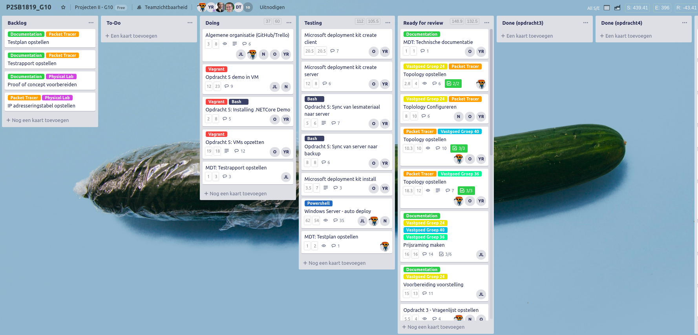
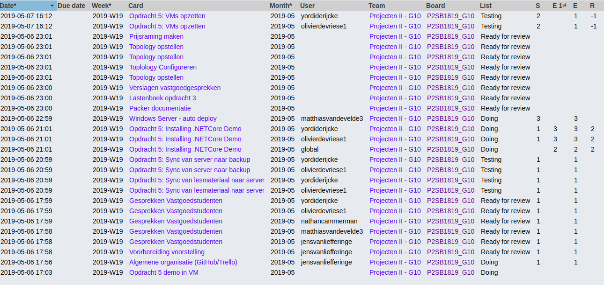
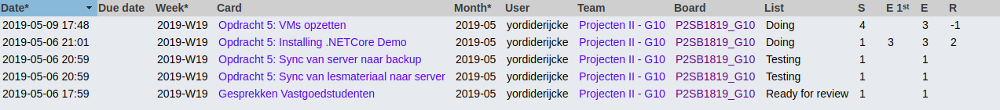
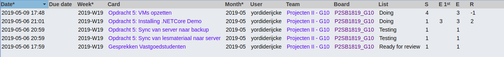
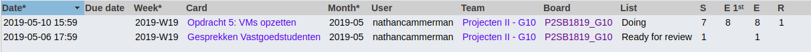
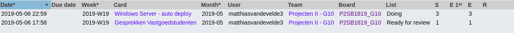
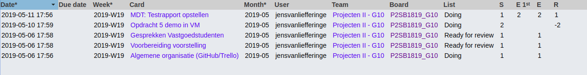

# Voortgangsrapport week 14

* Groep: 10
* Datum voortgangsgesprek: 13/05/2019

| Student  | Aanw. | Opmerking |
| :---     | :---  | :---      |
| Yordi De Rijcke |   x    |           |
| Olivier De Vriese |  x     |           |
| Nathan Cammerman |    x   |           |
| Jens Van Liefferinge |    x   |         |
| Matthias Van De Velde |   x    |           |

## Wat heb je deze week gerealiseerd?

### Algemeen

* Opdracht 5: fixed double provisioning issue in Vagrantfile
* Eindvoorstelling voor vastgoedstudenten
* Provisioning .NET application
* Added PXE boot functionality to Vagrantfile
* Added DNS provisioning to MDT
* Altered provisioning of backup sync
* Altered provisioning of teaching materials sync
* Fixed minor proivisioning issues
* Rerolled to Centos-7.2 to fix issue of folders not being created during provisioning

### Yordi De Rijcke
* Eindvoorstelling voor vastgoedstudenten
* Altered provisioning of backup sync
* Altered provisioning of teaching materials sync
* Eindvoorstelling voor vastgoedstudenten
* Fixed minor proivisioning issues

### Olivier De Vriese
* Eindvoorstelling voor vastgoedstudenten
* Altered provisioning of backup sync
* Altered provisioning of teaching materials sync
* Fixed minor proivisioning issues

### Nathan Cammerman
* Eindvoorstelling voor vastgoedstudenten
* Rerolled to Centos-7.2 to fix issue of folders not being created during provisioning
* Opdracht 5: fixed double provisioning issue in Vagrantfile
* Fixed minor proivisioning issues

### Matthias Van De Velde
* Eindvoorstelling voor vastgoedstudenten
* Added PXE boot functionality to Vagrantfile
* Added DNS provisioning to MDT

### Jens Van Liefferinge
* Offertes G36, G40 aangepast
* Opdracht 4: testrapport bijgewerkt
* Opdracht 5: provisioning debuggen

## Wat plan je volgende week te doen?

### Algemeen

### Yordi De Rijcke

### Olivier De Vriese

### Nathan Cammerman

### Matthias Van De Velde

### Jens Van Liefferinge

## Waar hebben jullie nog problemen mee?
* Inschatten van de provisioning van opdracht 4

## Feedback technisch luik

### Algemeen

### Yordi De Rijcke
### Olivier De Vriese
### Nathan Cammerman
### Matthias Van De Velde
### Jens Van Liefferinge

## Feedback analyseluik

### Algemeen

### Yordi De Rijcke
### Olivier De Vriese
### Nathan Cammerman
### Matthias Van De Velde
### Jens Van Liefferinge

