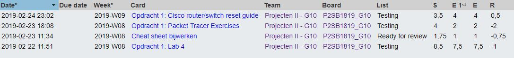

# Voortgangsrapport week nn

* Groep: 10
* Datum voortgangsgesprek:

| Student  | Aanw. | Opmerking |
| :---     | :---  | :---      |
| Yordi De Rijcke |   x    |           |
| Olivier De Vriese |   x    |           |
| Nathan Cammerman |    x   |           |
| Matthias Van De Velde |   x    |           |

## Wat heb je deze week gerealiseerd?

### Algemeen

[Afbeelding huidige toestand Kanban-bord(en) invoegen]

* ...
* ...

[Afbeelding teamoverzicht tijdregistratie onderverdeeld per deelopdracht]

### Yordi De Rijcke

* ...

[Afbeelding individueel rapport tijdregistratie]

### Olivier De Vriese

* ...

[Afbeelding individueel rapport tijdregistratie]

### Nathan Cammerman

* ...

[Afbeelding individueel rapport tijdregistratie]

### Matthias Van De Velde

* ...

  

## Wat plan je volgende week te doen?

### Algemeen
### Yordi De Rijcke
### Olivier De Vriese
### Nathan Cammerman
### Matthias Van De Velde

## Waar hebben jullie nog problemen mee?

* ...
* ...

## Feedback technisch luik

### Algemeen

### Yordi De Rijcke
### Olivier De Vriese
### Nathan Cammerman
### Matthias Van De Velde

## Feedback analyseluik

### Algemeen

### Yordi De Rijcke
### Olivier De Vriese
### Nathan Cammerman
### Matthias Van De Velde

